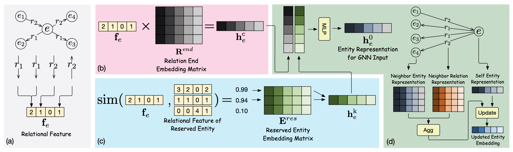

# EARL

This repository contains the experimental code for our AAAI 2023 paper: [Entity-Agnostic Representation Learning for Parameter-Efficient Knowledge Graph Embedding](https://arxiv.org/abs/2302.01849). In this paper, we propose an entity-agnostic representation learning (**EARL**) method for handling the problem of inefficient parameter storage costs brought by embedding knowledge graphs.



## Requirements

We run our code mainly based on ```PyTorch 1.11.0``` and ```DGL 0.8.1``` with CUDA. You can install cooresponding version based on your GPU resources. Furthermore,  we use```argparse``` to parse command lines.

## Dataset

We put experimental datasets in ```./data```. Each dataset includes a ```train.txt```, a ```valid.txt``` and a  ```test.txt```. ```entities.dict``` and ```relations.dict``` are used to map entities and relations into indices. 

We use ```pre_process.ipynb``` to generate relaional features for entities (i.e., ```ent_rel_feat.pkl```) and sample reserved entities (i.e., ```res_ent_0p1.pkl```) for each dataset. We have generated these two files for each dataset and you can also run the process procedure yourself by using ```pre_process.ipynb```. 

Furthermore, unzip datasets before using them.

## Quick Start

We give an example script for training and you can try the following command line:

```bash
bash script/train.sh
```

The training process, validation results, and final test results will be printed and saved in the corresponding log file. After training, you can find training logs in the ```log``` folder and the tensorboad logs are saved in the ```tb_log``` folder.

Moreover, you can try different datasets and settings by changing arguments in the  ```main.py```.

## Citation

If you use or extend our work, please cite the following paper:

```
@inproceedings{EARL,
  author    = {Mingyang Chen and
               Wen Zhang and
               Zhen Yao and
               Yushan Zhu and
               Yang Gao and
               Jeff Z. Pan and
               Huajun Chen},
  title     = {Entity-Agnostic Representation Learning for Parameter-Efficient Knowledge Graph Embedding},
  booktitle = {{AAAI}},
  year      = {2023}
}
```
